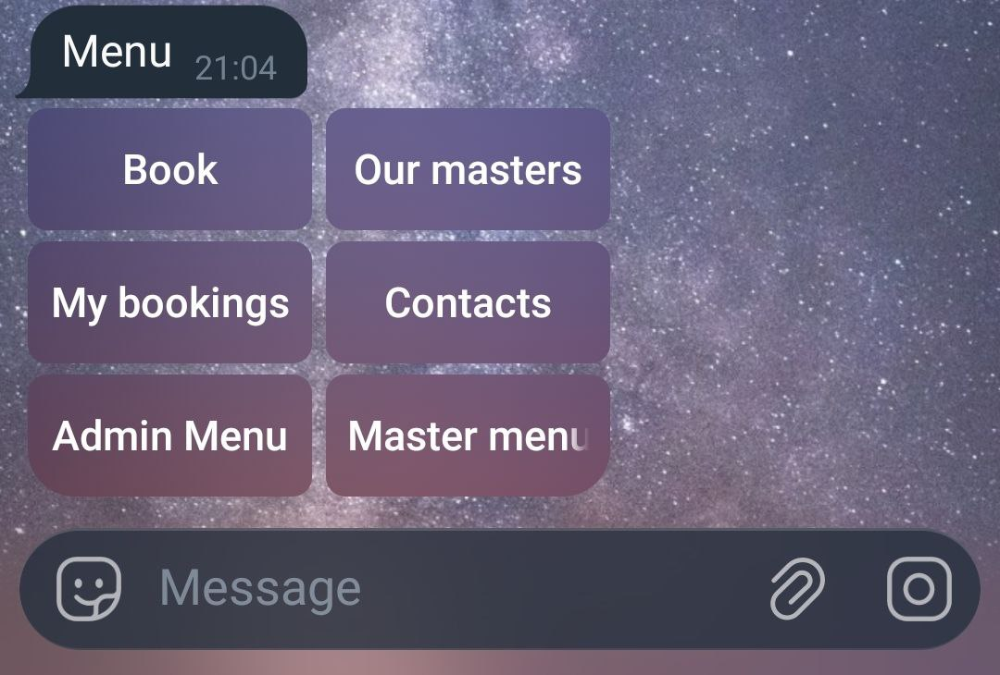
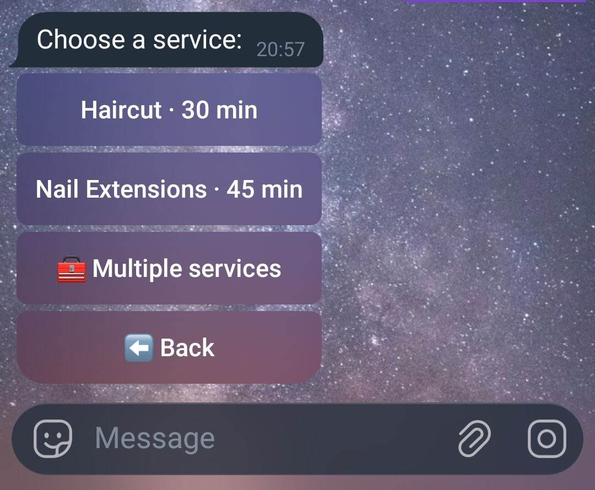
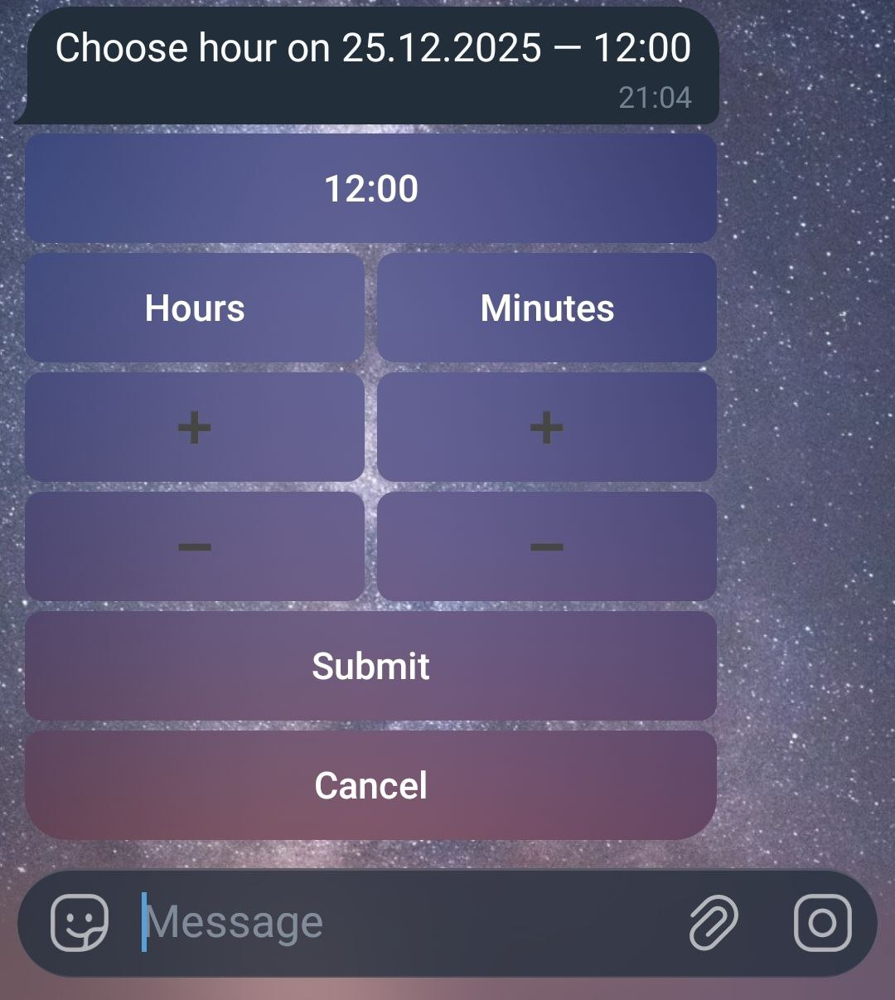
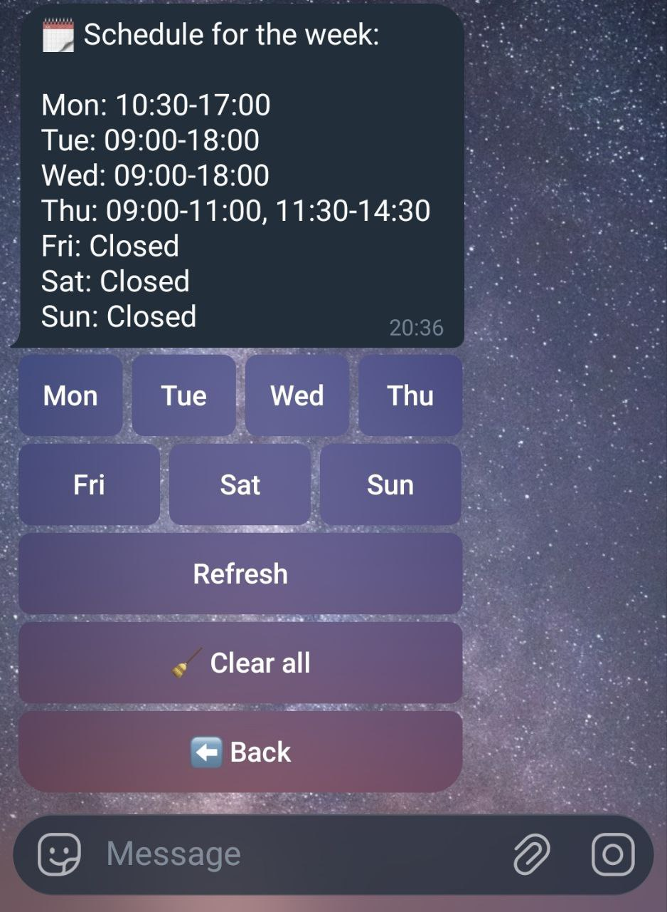
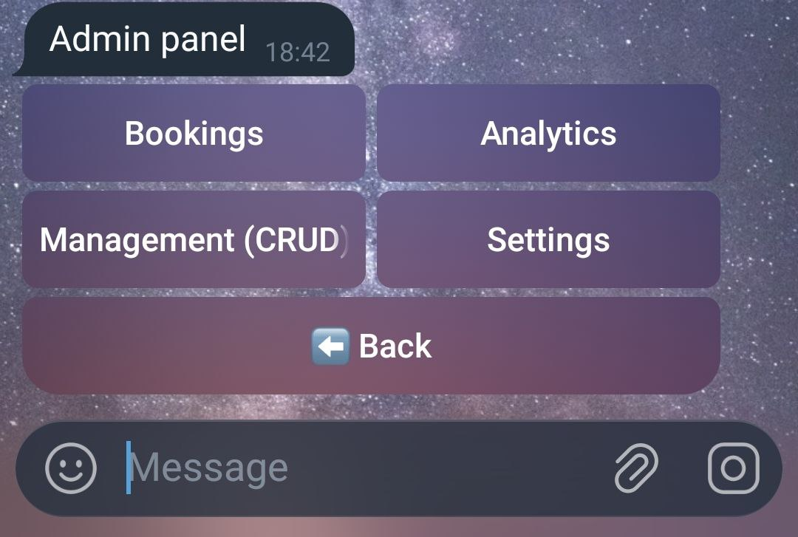
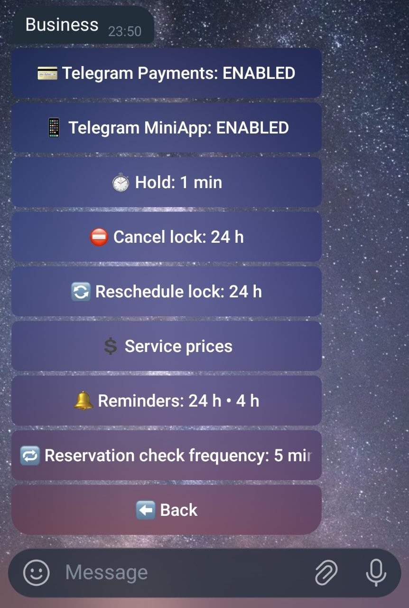

# Telegram Salon Booking Bot

A ready-to-use, self-hosted Telegram booking system for beauty salons and small businesses.  
Clients book appointments, masters manage schedules, and owners see analytics — all inside Telegram.  
One-time payment. No SaaS. No subscriptions.

👉 Try the demo or purchase the full version:
- Demo: https://t.me/PaywallClubBot
- Buy: [gumroad.com](https://pentogram.gumroad.com/l/xlbbb)

---

## ⚠️ Important
This repository does **NOT** contain source code.  
It is a public product overview and documentation page.

---

## What is this?

Telegram Salon Booking Bot is a **self-hosted appointment booking system** that works полностью inside Telegram.

It replaces:
- manual booking in chats
- spreadsheets
- missed messages
- double bookings

The bot automates the entire booking flow while staying **simple and human-friendly**.

---

## Who is it for?

This bot is designed for:
- Beauty salons  
- Barbershops  
- Local service businesses  
- Solo masters and small teams  

Perfect if you:
- already use Telegram with clients
- want less manual work
- don’t want subscriptions or SaaS platforms

---

## How it works

**For clients**
- Choose service
- Choose master
- Choose date & time
- Confirm booking

**For masters**
- View schedule
- See upcoming appointments
- Manage availability

**For owner**
- Full overview of bookings
- Basic analytics
- Control services and masters

Everything happens inside Telegram.

---

## Screenshots

  
<b><u>Client booking flow</u></b>

    
    
    
    
    
    
    
    

  
Master & Admin

    
    
    
    
    

---

## Features

- Client self-booking
- Master schedules
- Admin panel
- Analytics overview
- Multi-master support
- Telegram-native UX
- Docker-based deployment
- Self-hosted (you own your data)

---

## Demo

A demo bot is available to explore the booking flow.

👉 Demo link: **(add your demo bot or demo page here)**

Note:  
Demo may have limited functionality and is for preview purposes only.

---

## Purchase & License

This is a **paid product**.

- One-time payment
- No subscriptions
- No SaaS
- Self-hosted
- Lifetime access to the purchased version

👉 Purchase here: **(Gumroad / Ko-fi / Payhip link)**

---

## What is NOT included

Please note:
- ❌ No custom development
- ❌ No installation service
- ❌ No SaaS or hosted version

This product is delivered as-is.

---

## Support

I provide **friendly support for my own products**:
- help with basic setup questions
- guidance for using the bot

Support does not include custom features or modifications.

---

## Philosophy

I build tools for **real businesses**.

No overengineering.  
No unnecessary complexity.  
Just practical automation that saves time and makes life easier.

---

If your business works in Telegram — this bot was built for you.
