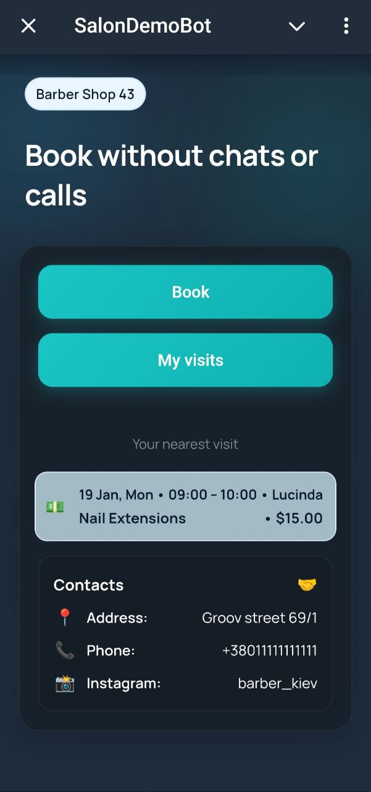
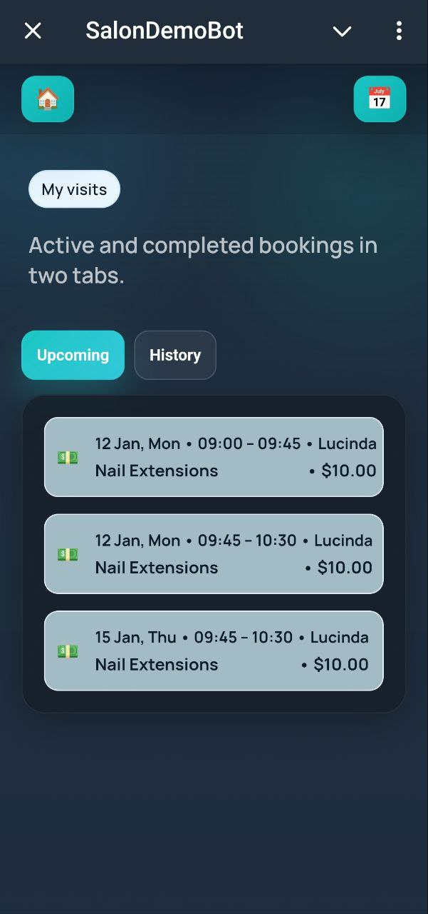
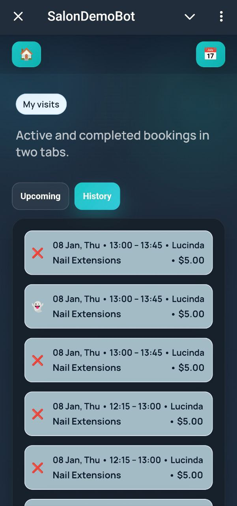
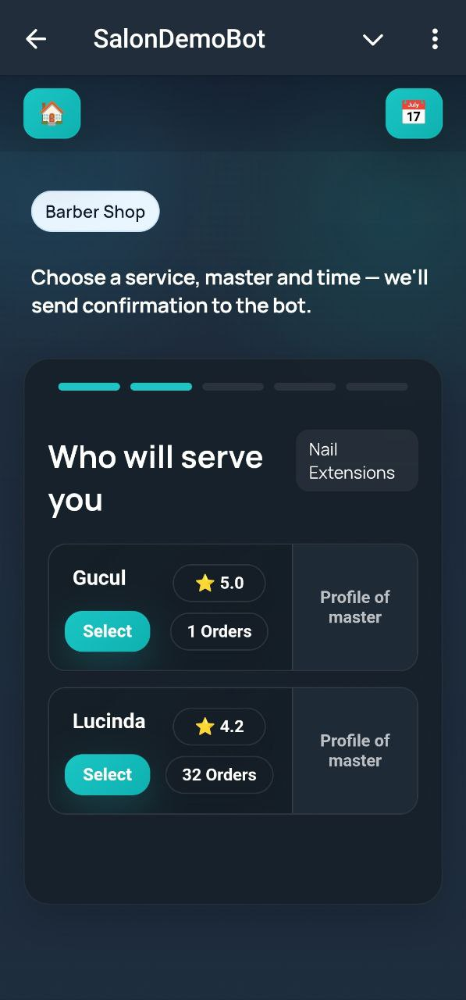
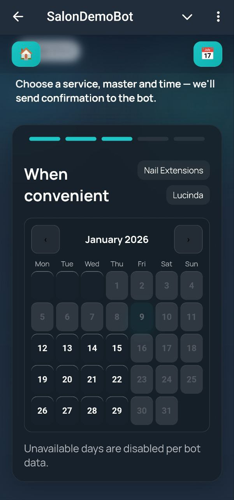
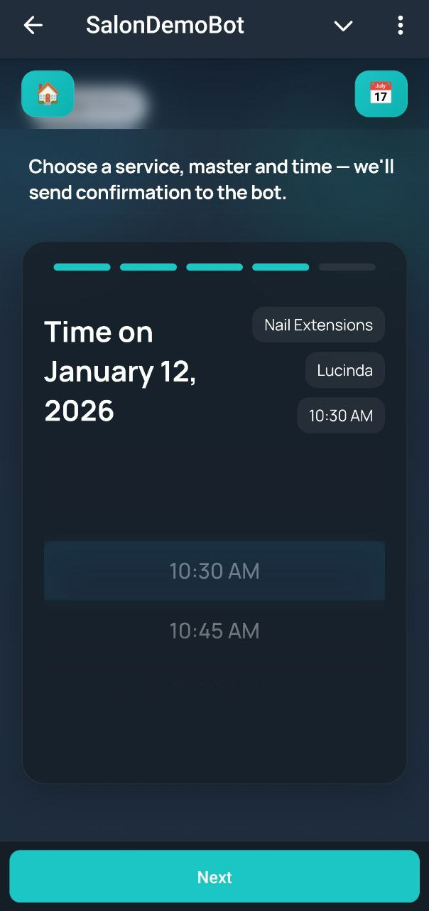
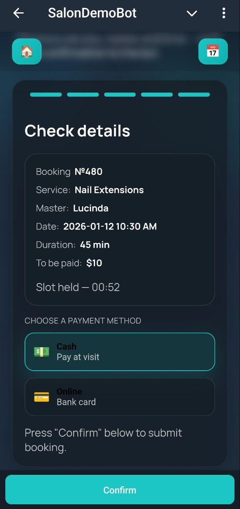
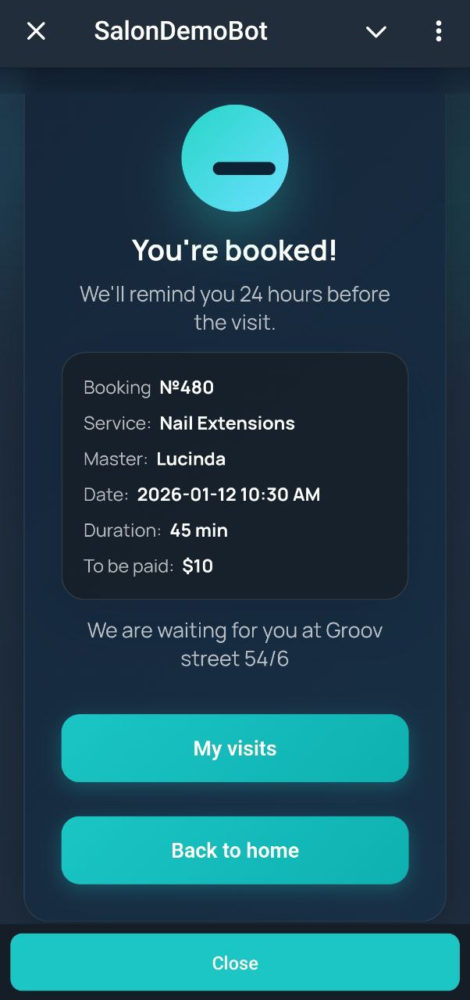
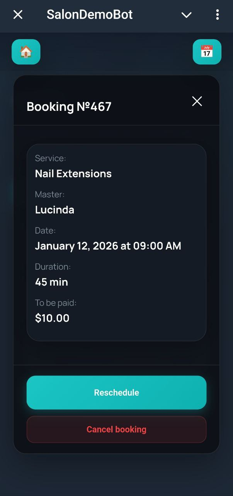

# 💇‍♂️ Telegram Salon Booking Bot

A ready-to-use, **self-hosted Telegram booking system** for beauty salons and small businesses.  
Clients book appointments, masters manage schedules, and owners manage operations — **all inside Telegram**.

**One-time payment · No SaaS · No subscriptions**

---

## 🚀 Try the demo or get the full version

- 🤖 **Demo on Telegram** — https://t.me/PaywallClubBot  
- 💳 **Buy on Gumroad** — https://pentogram.gumroad.com/l/xlbbb  
- 📦 **Buy on Payhip** — https://payhip.com/b/8LY2T  
- ☕ **Buy on Ko-fi** — https://ko-fi.com/s/937c0881d1

---

## 📬 Contact

Telegram: **@tartz_brewer**

---

## ⚠️ Important

This repository does **NOT** contain source code.  
It is a **public product showcase and documentation** page.

---

## 🧩 What is this?

**Telegram Salon Booking Bot** is a complete **self-hosted appointment booking system** that runs fully inside Telegram.

It replaces:
- manual booking in chats  
- spreadsheets  
- missed messages  
- double bookings  

The result: **automated scheduling with a clean, human-friendly experience**.

---

## 🎯 Who is it for?

Designed for:
- Beauty salons  
- Barbershops  
- Local service businesses  
- Solo specialists & small teams  

Perfect if you:
- already communicate with clients via Telegram  
- want fewer mistakes and less manual work  
- don’t want SaaS, subscriptions, or vendor lock-in  

---

## 🧭 How it works

### For Clients
- Choose service  
- Choose master  
- Choose date & time  
- Confirm booking  

### For Masters
- View schedule  
- Manage availability  
- See upcoming appointments  

### For Owners
- Full booking overview  
- Analytics & performance stats  
- Services & staff management  

Everything happens **inside Telegram**.

---

## 🖼 Screenshots

  
<b><u>Client booking flow</u></b>

    
    
    
    
    
    
    
    

  
<b><u>Telegram Mini App (Client)</u></b>

  
  
  
  
  
  
  
  
  

  
<b><u>Master & Admin panels</u></b>

    
    
    
    
    

---

## ✨ Key Features

- Client self-booking  
- Multi-master support  
- Admin dashboard  
- Booking analytics  
- Telegram-native UX  
- Docker-based deployment  
- Fully self-hosted (you own your data)

---

## 🚫 What is NOT included

- ❌ No custom development  
- ❌ No installation service  
- ❌ No SaaS or hosted version  

The product is delivered **as-is**.

---

## 🧑‍💻 Support

I provide **friendly support** for this product:
- help with setup  
- guidance on usage  

Custom feature development is not included.

---

## 🧠 Philosophy

Built for **real small businesses**.

No overengineering.  
No bloated dashboards.  
Just practical automation that saves time and prevents mistakes.

---

If your business runs on Telegram — **this bot was built for you**.
